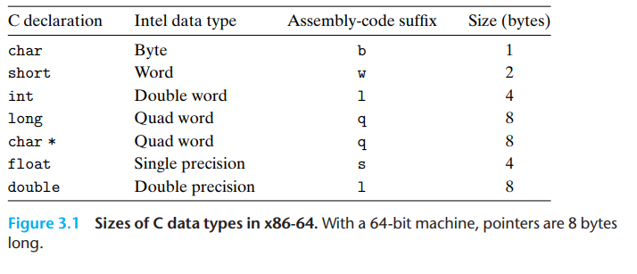
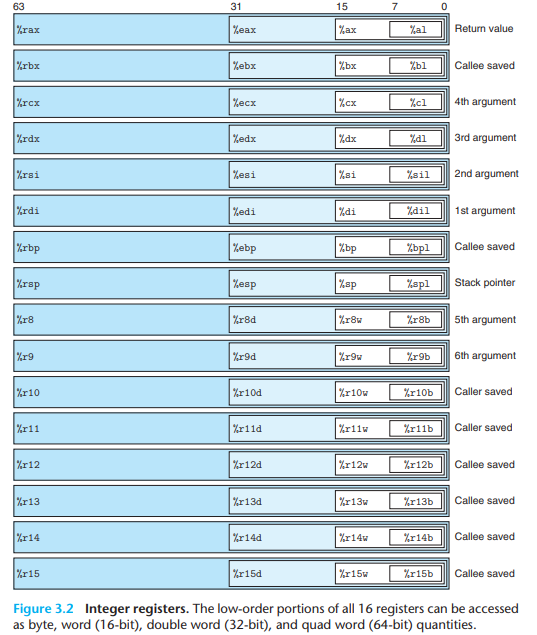
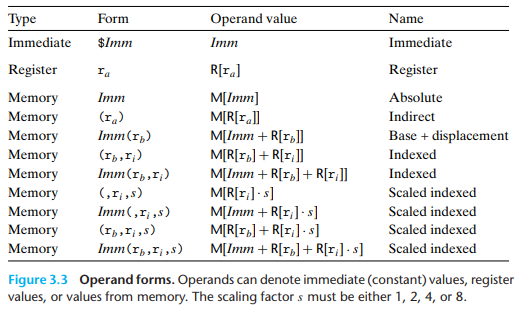

# the x86 Assembly reference sheet 
## Data Formats 

## Accessing Information
### Registers map 

### Operand Specifiers ( the destination location)

## the MOV code
- `mov S,D` Will do D ← S
- add `abs` for moving absolute value 
- you can add `b`,`w`,`l`or`q` to mange the data type size like `movq S,D`
- add `z`or`s` befor data size to controle how to deal with the new bits 
- `z` for zero-extending and `s` for sign-extinding
- add another data type to set the new reg size 
- Examble `movsbw`Move sign-extended byte to word