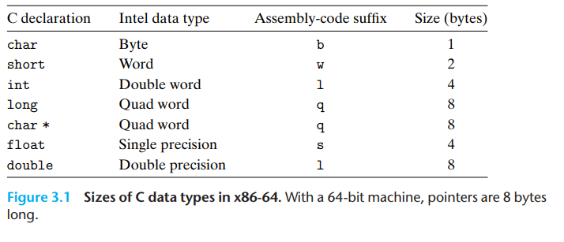
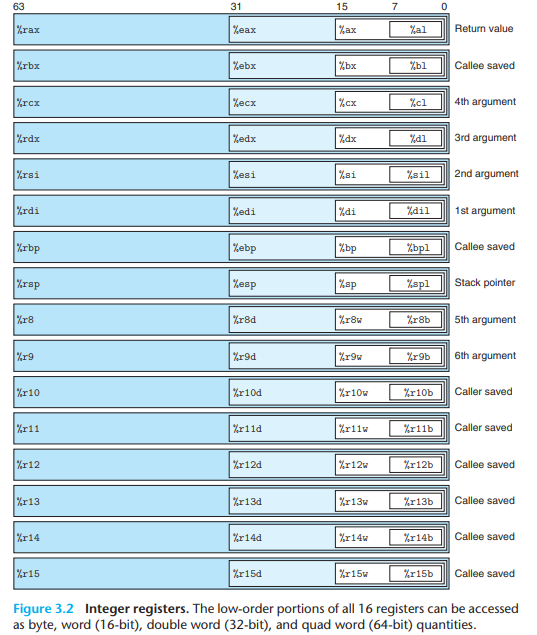
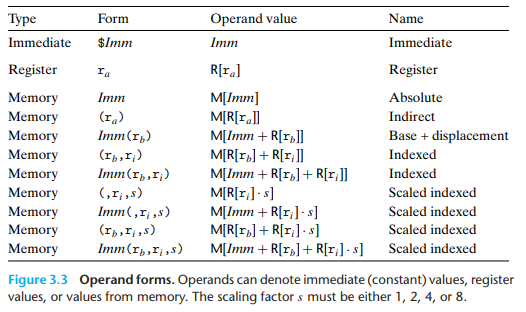
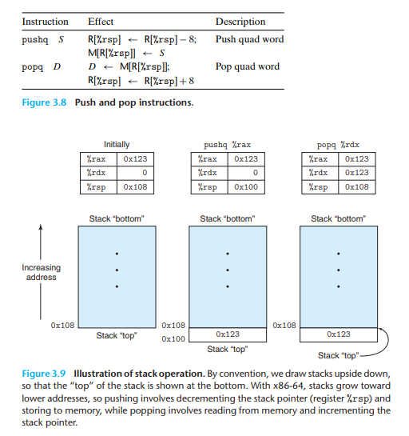
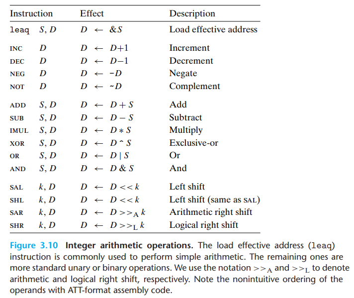
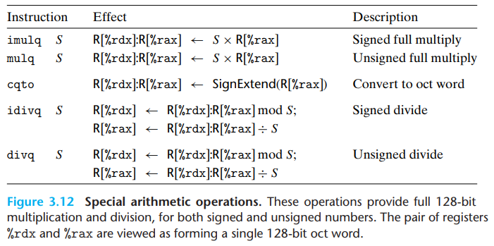
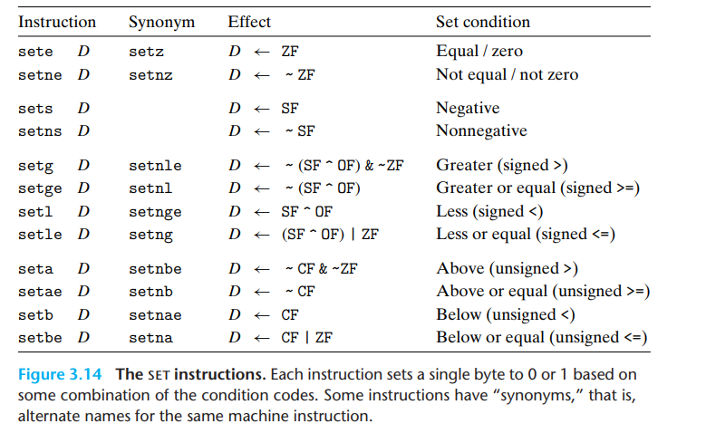
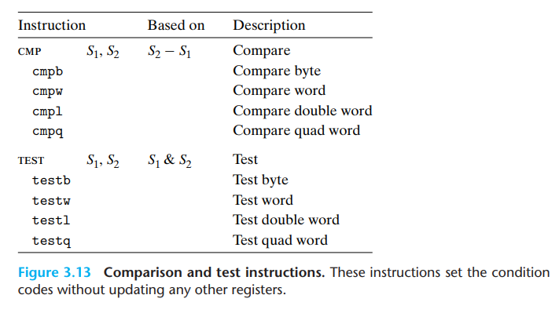

# the x86 Assembly reference sheet 
## Data Formats 

## Accessing Information
### Registers map 

### Operand Specifiers ( the destination location)

## the MOV code
- `mov S,D` Will do D ← S
- you can add `b`,`w`,`l`or`q` to mange the data type size like `movq S,D`
- add `z`or`s` befor data size to controle how to deal with the new bits Like `movzbq`
- `z` for zero-extending and `s` for sign-extinding
- add another data type to set the new reg size 
- Examble:`movsbw`Move sign-extended byte to word
## Stack operation

- useful for evaluating complex math expressions.
##  Arithmetic and Logical Operations

## Special Arithmetic Operations

## Condition Codes
- CF: Carry flag. The most recent operation generated a carry out of the most
significant bit. Used to detect overflow for unsigned operations. ` (unsigned) t < (unsigned) a`
- ZF: Zero flag. The most recent operation yielded zero `(t == 0)`
- SF: Sign flag. The most recent operation yielded a negative value. `(t < 0)`
- OF: Overflow flag. The most recent operation caused a two’s-complement
overflow—either negative or positive ` (a < 0 == b < 0) && (t < 0 != a < 0)`

